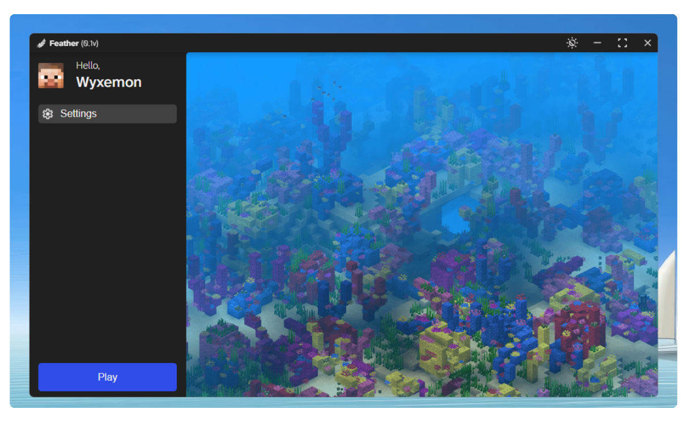

# Feather
The most secure Minecraft Launcher. Open Source Minecraft Launcher built in JavaScript (Electron).

## Download
- [Download for Mac OS](#)
- [Download for Windows](#)
- [Download for Linux](#)

## How to run
To get started, follow these steps:

1. Clone the repository to your local machine.
2. Navigate to the project folder.
3. Install dependencies by running:
   ```bash
   npm install
4. Run the proyect:
   ```bash
   npm run dev
